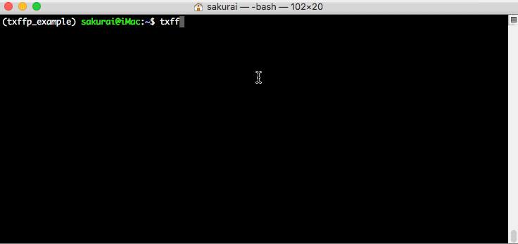

# txffpAssistant

   

为解决反人类设计的一款票根助手，适用于[票根网](https://txffp.com/)(pss.txffp.com)。

可执行发票下载、自动合并、查看发票信息等。


## 依赖
本项目基于python3开发，需要安装python3.4及以上版本。


## 安装
使用pip安装：

```
$ pip install --upgrade txffpAssistant
```

虚拟环境下安装([virtualenvwrapper](http://virtualenvwrapper.readthedocs.io/en/latest/))：

```
$ mkvirtualenv txffp_assistant
$ workon txffp_assistant
$ pip install --upgrade txffpAssistant
```


## 使用
查看ETC卡信息：

```
$ txffp etc --auth user:password
```

查看2018年5月份，etcid为xxx的开票记录信息：

```
$ txffp record --month 201805 --id xxx --auth user:password
```

下载2018年5月份的全部发票并合并：

```
$ txffp inv-dl --merge --month 201805 --auth user:password --all -o ./
```


## 参数
通用可选参数：

```
$ txffp -h

optional arguments:
  -h, --help           show this help message and exit
  -d, --debug          debug模式
  -s, --simple         精简模式
  -v, --version        查看当前版本并退出
```

``etc``命令参数：

```
$ txffp etc -h

optional arguments:
  -h, --help            show this help message and exit
  --type {personal,company,all}
                        etc卡类型，默认：all
  --auth AUTH           用户名和密码，格式：user:password
```

``record``命令参数：

```
$ txffp record -h

optional arguments:
  -h, --help            show this help message and exit
  --etcid ETC_ID           ETC卡ID
  --month MONTH         开票年月，例如: 201805
  --type {personal,company}
                        etc卡类型，默认：company
  --auth AUTH           用户名和密码，格式：user:password
```

``inv-dl``命令参数：

```
$ txffp inv-dl -h

optional arguments:
  -h, --help            show this help message and exit
  --month MONTH         开票年月，例如: 201805
  --type {personal,company,all}
                        etc卡类型，默认：company
  --merge MERGE         自动合并
  --auth AUTH           用户名和密码，格式：user:password
  --all DL_ALL          下载全部发票
  --etcid ETC_ID        ETC卡ID
  -o OUTPUT, --output OUTPUT
                        保存位置, 默认：当前目录的txffp目录下
```




## pdf合并说明
开启合并功能后，自动将已下载完成的zip文件内的pdf文件进行合并，并存放于下载目录下的merge文件夹下的同名文件夹内。
发票文件将会合并到invoice.pdf，pdf发票记录将会合并到invoiceDetail.pdf。

**目录示例：**

```
download/
├── invoice-xxxxx-example.zip
└── merged
    └── invoice-xxxxx-example
        ├── invoice.pdf
        └── invoiceDetail.pdf
```


## 反馈
如果在使用过程中出现bug等，请到 [https://github.com/Kairu-Madigan/txffpAssistant](https://github.com/Kairu-Madigan/txffpAssistant) 发起Issue。


## 版权
该项目根据GNU许可证授权，详细信息请查看[LICENSE](LICENSE)文件。


## 赞助
如果您觉得 txffpAssistant 对你有帮助，欢迎给予我一定的捐助来维持项目的长期发展。

**支付宝扫码捐赠**


**微信扫码捐赠**


